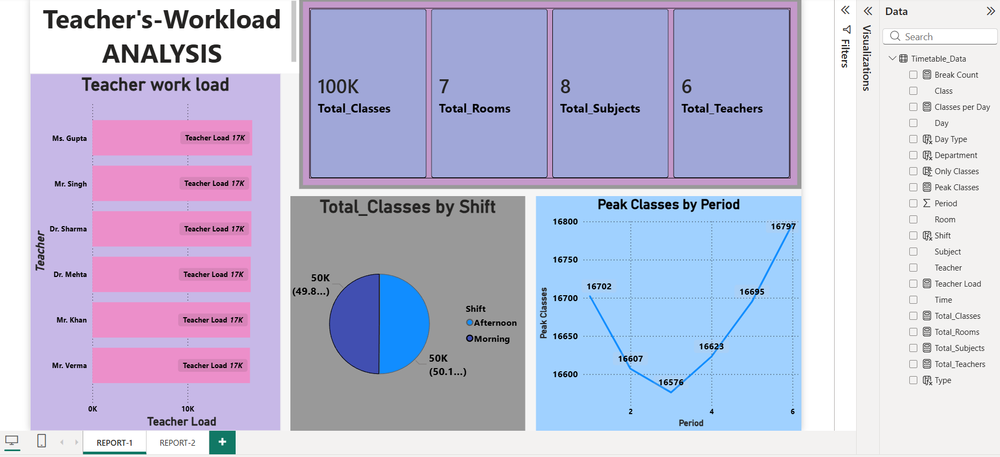
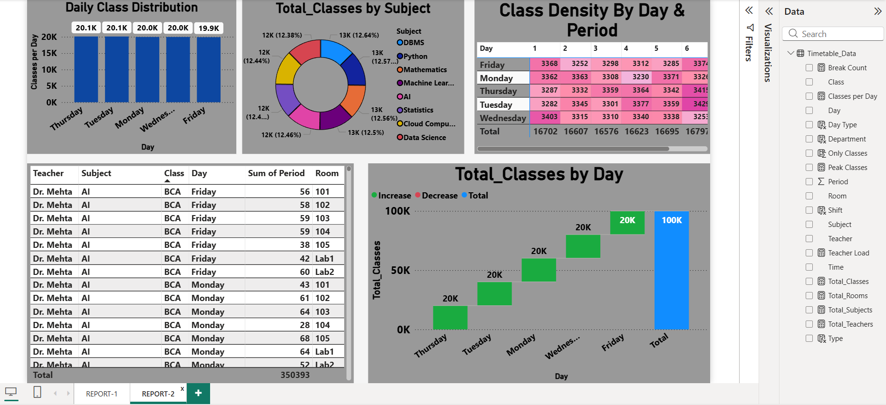

# 📊 Teacher Workload Analysis Dashboard

## 📌 Overview
This project is a Power BI dashboard created to analyze teacher workload and class distribution using a timetable dataset.

The analysis is based on period-wise data, where each period represents a fixed time slot instead of exact time duration.

---

## 🎯 Objectives
- Analyze teacher workload
- Identify peak class periods  
- Compare class distribution across days and shifts  
- Ensure balanced subject allocation  

---

## 📊 Key Insights
- Workload is equally distributed among teachers  
- Morning and Afternoon shifts have equal classes  
- Peak load occurs in later periods  
- Subjects are evenly distributed  

---

## 🛠️ Tools Used
- Power BI  

---

## 📁 Dataset
This project uses a sample dataset for analysis purposes.

---

## 📷 Dashboard Preview

---

## 📌 Conclusion
This dashboard helps in understanding workload distribution and improving timetable planning efficiency.

---

## 🔗 Author
Riya Basera
